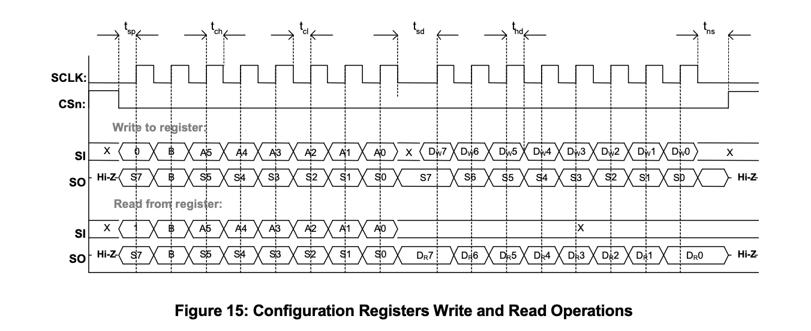
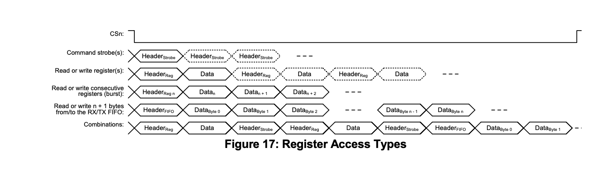

###  Register Access and Configuration of the CC1101

The CC1101 RF transceiver communicates with the host microcontroller
through the Serial Peripheral Interface (SPI), which serves as the
primary interface for device configuration and data exchange. All
operating parameters of the transceiver are controlled through internal
registers, where each register is assigned a unique address and stores
an 8-bit value. These registers configure various radio parameters
including operating frequency, modulation format, data rate, transmit
power, packet handling, synchronization settings, GPIO behavior, and
other modem-related functions. By writing appropriate values into these
registers, the microcontroller configures the CC1101 according to the
communication requirements of the application. *(Source: CC1101
Datasheet, Rev. I, Section 10.2 -- Register Access, pp. 31)

Every SPI communication with the CC1101 begins with the transmission of
a header byte. This header contains three important fields: the
Read/Write ($R/\overline{W}$) bit, the Burst ($B$) bit, and the 6-bit
register address. The Read/Write bit determines whether the SPI
transaction performs a register read or a register write operation. The
Burst bit specifies whether the communication accesses only a single
register or multiple consecutive registers during the same SPI
transaction. The remaining six bits identify the target register address
inside the CC1101 register map. Based on this header information, the
transceiver interprets the subsequent SPI communication and performs the
requested register access operation.

 Configuration Registers Write and Read Operations.  
*Source: CC1101 Datasheet, Rev. I, Figure 15, p. 31.*

___

When a single register access is performed, the microcontroller sends
the header byte followed by either one data byte (during a write
operation) or receives one data byte from the CC1101 (during a read
operation). In this mode, only one register is accessed during the SPI
transaction. This method is typically used when modifying or reading an
individual configuration parameter without affecting other registers.
*Source: CC1101 Datasheet, Rev. I, Section 10.2 -- Register Access,
p. 32.*

For applications requiring multiple consecutive registers to be
accessed, the CC1101 supports burst mode. In burst access, the
microcontroller sets the Burst bit in the header byte before
transmitting the starting register address. After the first register is
accessed, the CC1101 automatically increments the register address
internally, allowing subsequent registers to be read or written without
transmitting additional address bytes. This process continues until the
microcontroller terminates the transaction by driving the $CSn$ pin
high. Burst mode significantly improves SPI communication efficiency by
reducing protocol overhead and increasing data transfer speed. However,
burst access is supported only for configuration registers and FIFO
memory and is not supported for status registers (addresses
`0x30`--`0x3D`).

###  Register Access Types

The figure below illustrates the various register access methods supported by the CC1101...

 Register Access Types.  
*Source: CC1101 Datasheet, Rev. I, Figure 17, pp. 32–33.*

___

The microcontroller controls all register accesses by initiating SPI
communication through the $CSn$ (Chip Select) signal. At the beginning
of every transaction, the microcontroller pulls the $CSn$ pin low, after
which it transmits the SPI header byte containing the operation type and
register address. During a write operation, the microcontroller sends
one or more data bytes that are stored in the selected register
locations. During a read operation, the CC1101 returns the contents of
the requested register over the SPI interface. Once the transaction is
complete, the $CSn$ pin is driven high, marking the end of
communication. Through this mechanism, the microcontroller can
continuously configure and monitor the internal operation of the
transceiver.( *Source: CC1101 Datasheet, Rev. I, , pp. 31--32.*)

The configuration of the CC1101 begins by determining the communication
requirements of the intended wireless application. Parameters such as
operating frequency, modulation technique, channel bandwidth, data rate,
packet length, synchronization word, transmit power, frequency
deviation, cyclic redundancy check (CRC), and data whitening are first
selected based on the system requirements. Each of these communication
parameters corresponds to one or more configuration registers within the
CC1101 register map. <mark>The required register values are then calculated
using the equations provided in the datasheet or generated automatically
using Texas Instruments SmartRF™ Studio, which simplifies the
configuration process by computing the correct register settings for the
desired radio characteristics</mark>. (*Source: CC1101 Datasheet, Rev. I,
Section 13 -- Modem Configuration, p. 39; Section 29 -- Configuration
Registers, p. 66; SmartRF™ Studio User's Guide.*)

####  Manual Calculation of Configuration Register Values

Although Texas Instruments SmartRF™ Studio can automatically generate
the required register settings, the CC1101 datasheet also provides
mathematical equations that allow the configuration registers to be
calculated manually. Manual calculation is particularly useful for
understanding how each radio parameter influences the operation of the
transceiver and for verifying register values generated by software
tools. (*Source: CC1101 Datasheet, Rev. I pp. 35--45; 
p. 66.*)

The configuration process begins by selecting the desired communication
parameters such as the operating frequency, data rate, channel
bandwidth, frequency deviation, modulation format, and intermediate
frequency. These parameters are then converted into register values
using the equations provided in the datasheet. The calculated
hexadecimal values are subsequently written into the corresponding
configuration registers through the SPI interface, allowing the CC1101
to operate according to the specified radio characteristics. (*Source:
CC1101 Datasheet, Rev. I, Section 13 -- Modem Configuration, pp. 39--45;
Section 29 -- Configuration Registers, p. 64.*)

##### Operating Frequency Calculation

The carrier frequency of the CC1101 is determined by three frequency
control registers: FREQ2, FREQ1, and FREQ0. These three registers
together form a 24-bit frequency control word. The desired RF operating
frequency is converted into this frequency word using the following
equation:

$$\text{FREQ} = \frac{f_{\text{RF}} \times 2^{16}}{f_{\text{XOSC}}}$$

where:

-   $f_{\text{RF}}$ = Desired operating frequency (Hz)
-   $f_{\text{XOSC}}$ = Crystal oscillator frequency (typically 26 MHz)
-   $\text{FREQ}$ = 24-bit frequency control word stored split across
    FREQ2:FREQ1:FREQ0

After calculating the frequency word, it is divided into three bytes and
loaded into the FREQ2, FREQ1, and FREQ0 registers.

*Source: CC1101 Datasheet, Rev. I, Section 13.5 -- Frequency
Programming, p. 41; Section 29 -- Configuration Registers, pp. 75--76.*

##### Data Rate Calculation

The transmission data rate is controlled by the MDMCFG3 and MDMCFG4
registers. The CC1101 calculates the actual data rate according to the
following formula:

$$
R_{\text{data}}=
\frac{(256+\mathrm{DRATE}_M)\times2^{\mathrm{DRATE}_E}\times f_{\text{XOSC}}}
{2^{28}}
$$

where:

- $\mathrm{DRATE}_M$ = Data rate mantissa (MDMCFG3 register)
- $\mathrm{DRATE}_E$ = Data rate exponent (MDMCFG4 register)
- $f_{\text{XOSC}}$ = Crystal oscillator frequency

The mantissa and exponent values are selected such that the calculated
data rate closely matches the required communication speed.

(*Source: CC1101 Datasheet, Rev. I, Section 12 -- Data Rate
Programming, p. 35 ; Section 29 -- Configuration Registers*)

##### Channel Bandwidth Calculation

The receiver channel filter bandwidth is determined using the fields
within the MDMCFG4 register. This bandwidth is calculated using the
following relationship:

$$
\text{BW}_{\text{channel}}=
\frac{f_{\text{XOSC}}}
{8(4+\mathrm{CHANBW}_M)2^{\mathrm{CHANBW}_E}}
$$

where:

- $\mathrm{CHANBW}_M$ = Channel bandwidth mantissa
- $\mathrm{CHANBW}_E$ = Channel bandwidth exponent

The selected bandwidth should be sufficiently wide to accommodate the
transmitted signal while minimizing the reception of unwanted
out-of-band noise and adjacent-channel interference.

(*Source: CC1101 Datasheet, Rev. I, ; section 13 pg no 35 ,Section 29 -- Configuration Registers, p. 76.*)

##### Frequency Deviation Calculation

The frequency deviation required for FSK-based modulation formats is
programmed using the DEVIATN register. The resulting deviation is
calculated via:

$$
\Delta f=
\frac{f_{\text{XOSC}}}{2^{17}}
(8+\mathrm{DEVIATION}_M)
2^{\mathrm{DEVIATION}_E}
$$

where:

- $\mathrm{DEVIATION}_M$ = Deviation mantissa
- $\mathrm{DEVIATION}_E$ = Deviation exponent

The chosen frequency deviation must be compatible with the selected
modulation format and transmission data rate to ensure reliable,
error-free communication.

(*Source: CC1101 Datasheet, Rev. I, Section 16 -- Frequency Deviation,
p. 42; Section 29 -- Configuration Registers *)

##### Register Programming After Manual Calculation

After all the required register values have been calculated, each value
is converted into hexadecimal format and written into its corresponding
configuration register through the SPI interface. The microcontroller
sequentially writes the calculated values to registers such as FREQ2,
FREQ1, FREQ0, MDMCFG4, MDMCFG3, MDMCFG2, DEVIATN,
PKTCTRL0, PKTCTRL1, and PKTLEN. Once these registers have been
programmed, the CC1101 immediately operates using the newly configured
radio parameters. 

------------------------------------------------------------------------

After the required register values have been determined, the
microcontroller programs the CC1101 by writing these values through the
SPI interface. For each configuration parameter, the microcontroller
identifies the corresponding register address from the register map,
initiates an SPI write transaction by pulling the $CSn$ pin low,
transmits the write header containing the register address, and finally
sends the new register value. The CC1101 stores the received data in the
specified register, replacing the previous value. Once the register
update is complete, the internal hardware immediately uses the new
configuration during radio transmission and reception, thereby enabling
the desired operating characteristics. (*Source: CC1101 Datasheet,
Rev. I, Section 10.2 -- Register Access, p.31- 32; Section 29 --
Configuration Registers, p. 64.*)

| Register | Function | Why it is Used |
|:---------|:---------|:---------------|
| PKTCTRL0| Enables **CRC**, **data whitening**, and selects the packet format. | Improves error detection capability and increases the robustness of the transmitted data stream. |
| PKTCTRL1 | Controls packet handling and address filtering. | Ensures that only packets addressed to the receiver are accepted, reducing unnecessary packet processing. |
| SYNC1, SYNC0 | Stores the synchronization word. | Enables the receiver to accurately detect the beginning of each received packet for proper synchronization. |
| MDMCFG1 | Configures the preamble length and enables **Forward Error Correction (FEC)**. | A longer preamble improves synchronization, while FEC enhances communication reliability in noisy environments. |
| MDMCFG2| Selects the modulation format (2-FSK, GFSK, ASK/OOK, or MSK) and synchronization mode. | Determines how digital data is modulated onto the RF carrier for transmission. |
| MDMCFG3, MDMCFG4 | Configures the communication data rate and receiver channel bandwidth. | The selected values directly influence communication speed, receiver sensitivity, and overall link reliability. |
| DEVIATN | Sets the frequency deviation for FSK-based modulation. | The deviation must be compatible with the selected modulation format and data rate to ensure reliable communication. |
| PKTLEN | Specifies the packet length. | Defines the maximum number of bytes contained in each transmitted or received packet. |
---
\
This document  explained the register access and configuration process of the CC1101 RF transceiver using the SPI interface. It described the different register access methods, including single and burst mode operations, and their role in configuring the transceiver. The required register values are then calculated
using the equations provided in the datasheet or generated automatically
using Texas Instruments SmartRF™ Studio . The manual calculation of important communication parameters such as operating frequency, data rate, channel bandwidth, and frequency deviation was presented using the equations provided in the CC1101 datasheet. The functions of the key configuration registers responsible for packet handling, synchronization, modulation, and packet transmission were also discussed. Finally, the register programming procedure demonstrated how the calculated values are written into the CC1101 to configure the transceiver for reliable and efficient wireless communication in accordance with the application requirements.
