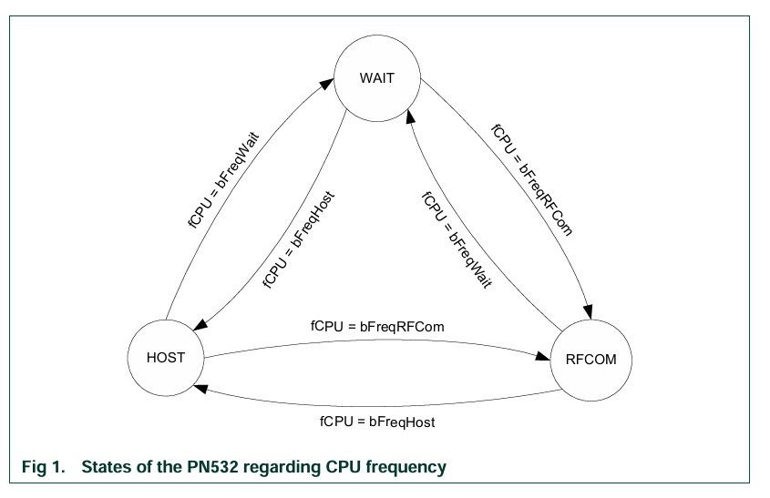
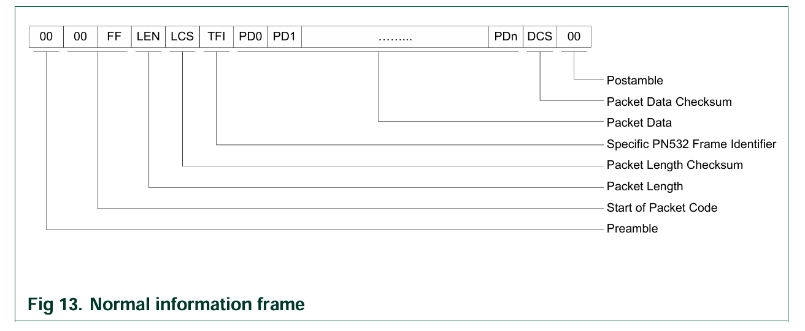

# PN532 Module

The PN532 is a highly integrated transmission module for contactless communication at 13.56 MHz including microcontroller functionality based on an 80C51 core with 40 Kbytes of ROM and 1 Kbytes of RAM.

---

## CPU Frequency & Operational States

The PN532 operates under three distinct internal states depending on active communication demands:

* WAIT: The default idle state when the PN532 is not actively managing communication with either the host controller or an external RF device.
* HOST: Active state when the PN532 is actively exchanging data (reception or transmission) with the host microcontroller.
* RFCOM: Active state when the PN532 is managing data exchange over the 13.56 MHz RF channel.
*Source: UM0701-02 PN532 Datasheet 3.1.1 CPU Frequency p.9*

---

## Host controller Interfaces

The system host controller can communicate with the PN532 by using the SPI, I2C or HSU (High Speed UART) serial links. Only one link can be used at once, and the choice is done by a hardware configuration (Interface mode lines I0-I1) during the power up sequence of the chip.

| Interface | Selection Pin I0 (pin #16) | Selection Pin I1 (pin #17) |
| :--- | :---: | :---: |
| HSU | 0 | 0 |
| I2C | 1 | 0 |
| SPI | 0 | 1 |
| RFU | 1 | 1 |

---

## Operating Modes of the PN532

### 1. Idle / Power-Down Mode

After reset or during periods without RF activity, the PN532 remains in an idle state in which no RF field is generated. In this mode, the internal RF circuitry is disabled in order to reduce power consumption, while the selected host communication interface remains active. The PN532 waits for commands from the host controller and does not initiate any RF communication. This mode is intended for standby operation when contactless functionality is temporarily not required. The device can exit this mode upon reception of a valid host command or when configured to enter an RF operating mode. Idle mode ensures minimal energy usage and avoids unnecessary electromagnetic emissions.

### 2. Reader / Initiator Mode

In Reader (Initiator) mode, the PN532 generates a continuous 13.56 MHz RF field and actively initiates communication with passive contactless targets. The device transmits polling commands according to the selected RF protocol in order to detect and activate nearby cards or devices. Once a target is detected, the PN532 performs protocol-specific anti-collision and selection procedures. All RF modulation, demodulation, framing, and timing are handled internally by the PN532. This mode supports ISO/IEC 14443 Type A and Type B as well as FeliCa communication. Reader mode is used when the PN532 acts as the controlling device in the contactless communication process.

### 3. Card Emulation / Target Mode

In Card Emulation (Target) mode, the PN532 operates as a passive target and does not generate its own RF field. Instead, it responds to an external RF field produced by an NFC initiator. The PN532 communicates by modulating the external field in accordance with the selected protocol. In this mode, the device behaves similarly to a contactless smart card and follows strict timing requirements defined by NFC and ISO/IEC standards. The PN532 internally manages these timing constraints to ensure compliant responses. Card Emulation mode enables applications such as virtual cards and NFC-based identification systems.

### 4. Peer-to-Peer (NFCIP-1) Mode

In Peer-to-Peer mode, the PN532 supports bidirectional communication with another NFC device using the NFCIP-1 protocol as defined in ISO/IEC 18092. Depending on the negotiation phase, the PN532 can operate either as an initiator or as a target. During communication, both devices may alternate roles in a controlled manner. The PN532 manages RF field control, protocol handling, and data framing internally. This mode allows direct data exchange between two active NFC devices without the presence of a passive card. Peer-to-Peer mode is typically used for device-to-device communication applications.

---

## RF Configuration Overview

The PN532 integrates an analog RF front-end and digital protocol controller for 13.56 MHz contactless communication. RF behavior is configured through firmware commands and internal registers.

### Supported RF Standards

#### ISO/IEC 14443 Type A

The PN532 supports ISO/IEC 14443 Type A proximity card communication at 13.56 MHz. It provides full support for modulation, framing, anti-collision, and protocol handling required by the standard. The device enables communication with MIFARE Classic, MIFARE Ultralight, and MIFARE DESFire products. All timing and RF protocol requirements are handled internally by the PN532. The RF field is generated by the PN532 when operating in reader mode, while the card responds using load modulation. This standard is optimized for short-range, high-reliability contactless communication.

#### ISO/IEC 14443 Type B

The PN532 supports ISO/IEC 14443 Type B proximity card communication. The device manages Type B specific initialization, framing, and protocol processing. RF communication parameters and timing constraints defined by the standard are internally controlled. This allows reliable communication with Type B compliant contactless cards. The protocol provides structured data exchange and enhanced noise immunity. Type B operation is suitable for secure identification and smart card applications.

#### FeliCa (212 kbps / 424 kbps)

The PN532 supports FeliCa contactless communication operating at data rates of 212 kbps and 424 kbps. The device handles FeliCa polling, data framing, and protocol timing internally. High data-rate operation enables fast data exchange with FeliCa-compliant cards and devices. The PN532 automatically adapts its RF parameters according to the selected FeliCa mode. This standard is commonly used in high-speed transaction systems.

#### NFCIP-1 (ISO/IEC 18092)

The PN532 supports NFCIP-1 communication as defined in ISO/IEC 18092. The device can operate in initiator or target mode for peer-to-peer communication. RF field control, protocol handling, and data exchange are managed internally. This standard enables direct communication between active NFC devices without the use of a passive card. Role switching between initiator and target is supported as defined by the protocol. NFCIP-1 is intended for short-range device-to-device data exchange.

### RF Configuration Timeout

When configuring CfgItem 0x02 (RF timeout), the PN532 allows control over the maximum time it waits for a response during RF communication. The timeout duration **T** is calculated based on the parameter n, which defines how long the device waits before terminating an RF operation and reporting a timeout error.

If the parameter *n* is set to zero, the timeout mechanism is disabled and the PN532 waits indefinitely for a response. For values of n between 1 and 16, the timeout duration follows an exponential relationship, allowing flexible adjustment of waiting time according to application requirements.

#### Timeout Formula

- If n = 0: No timeout  
- If *1 ≤ n ≤ 16*:  
  **T = 100 ms × 2⁽ⁿ⁻¹⁾**

This exponential scaling enables the PN532 to support both fast polling operations and more tolerant communication with slower or weakly coupled targets. Smaller timeout values reduce response latency and improve system responsiveness, while larger timeout values increase communication robustness in noisy RF environments or with low-power passive cards. Proper configuration of the RF timeout is essential to balance performance and reliability in contactless communication systems.

### Key RF-Related Commands
- RFConfiguration (0x32) – Configure RF timings, retries, and modulation parameters.
- InListPassiveTarget (0x4A) – Start passive target polling.
- InAutoPoll (0x60) – Automatic multi-protocol polling.

*Source: PN532 User Manual (UM0701), Section 7.3 – RF Communication Command*

---

## PN532 Communication Frame Format

All PN532 communication over SPI, I2C, or HSU follows a standardized frame format.
A **frame** is the basic data unit used for communication between the host and the PN532, containing control, length, data, and checksum information.

### Normal Frame Structure

A normal PN532 communication frame consists of the following fields, transmitted in the order listed below:

- **Preamble (1 byte):**  
  This field is always set to `0x00` and is used to indicate the beginning of a frame.  
  It allows the receiver to synchronize with the incoming data stream before frame decoding starts.

- **Start Code (2 bytes):**  
  The start code is fixed at `0x00 0xFF` and marks the start of a valid frame.  
  This unique pattern distinguishes a valid PN532 frame from idle or invalid data on the bus.

- **Length (LEN) (1 byte):**  
  This byte specifies the total number of bytes in the frame payload, including the TFI and data bytes.  
  It enables the receiver to determine how many bytes must be read to complete the frame.

- **Length Checksum (LCS) (1 byte):**  
  The length checksum is calculated such that the sum of LEN and LCS equals `0x00`, ensuring the integrity of the length information.  
  Any mismatch in this checksum indicates a frame formatting error.

- **Frame Identifier (TFI) (1 byte):**  
  The TFI indicates the direction of communication. A value of `0xD4` denotes a frame sent from the host to the PN532, while `0xD5` denotes a frame sent from the PN532 to the host.  
  This byte allows the receiver to correctly interpret the source of the frame.

- **Data Payload (N bytes):**  
  This field contains the command parameters or response data associated with the transmitted frame.  
  The content and length of this field depend on the specific command or response being exchanged.

- **Data Checksum (DCS) (1 byte):**  
  The data checksum is computed such that the sum of the TFI, all data bytes, and the DCS equals `0x00`, providing data integrity verification.  
  It ensures that the transmitted data has not been corrupted during communication.

- **Postamble (1 byte):**  
  The postamble is always set to `0x00` and indicates the end of the frame.  
  This byte provides a clear termination point for the frame.

### Checksum Rules
PN532 frames use an 8-bit two’s-complement checksum mechanism. All checksum calculations are performed modulo 256.

* Length Checksum (LCS): LCS = 0x100 - LEN
* Data Checksum (DCS): DCS = 0x100 - (TFI + sum of DATA bytes)

*Source: PN532 User Manual (UM0701), Section 6.2.1 – Frame Structure*

---

## Error Handling

If an operation fails, the PN532 returns a specific application-tier error byte.

| Error Cause | Error Code |
| :--- | :---: |
| Time Out | 0x01 |
| CRC Error | 0x02 |
| Parity Error | 0x03 |
| Bit Count Error | 0x04 |
| Framing Error | 0x05 |
| Bit-Collision Error | 0x06 |
| Buffer Insufficient | 0x07 |
| RF Buffer Overflow | 0x09 |
| RF Field Error | 0x0A |
| RF Protocol Error | 0x0B |
| Temperature Error | 0x0D |
| Internal Buffer Overflow | 0x0E |
| Invalid Parameter | 0x10 |
*Source: PN532 User Manual (UM0701), Section 7.1 – Error Handling*

---

The PN532 represents an integrated solution for 13.56 MHz contactless communication. Its internal architecture, which combines microcontroller functionality with a dedicated RF front-end, allows for efficient management of complex NFC protocols, including ISO/IEC 14443 and FeliCa.

---
